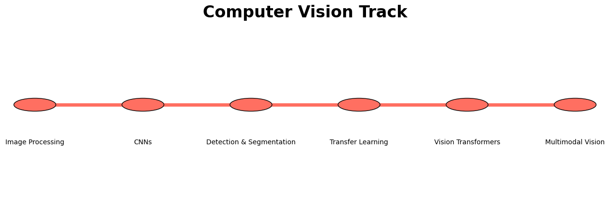

# AI Learning Roadmap

## 1. Preamble

This roadmap is designed for absolute beginners with **no prior experience** in computer science or mathematics.  It provides a step‑by‑step pathway through foundational topics into the most modern areas of artificial intelligence.  Each section explains why the knowledge is important and lists **free** resources.  Topics build on one another, so you can follow the tracks sequentially or dip into specific areas once you have the necessary prerequisites.  To keep the journey approachable, jargon is explained in plain language and resources are marked with a difficulty tag:

- **Easy** – gentle introductions or beginner‑friendly materials.
- **Medium** – assumes some basic familiarity with the prerequisites.
- **Hard** – in‑depth or mathematically rigorous content.

The diagrams shown throughout (see `/images` folder) depict each track as a subway‑style path so that prerequisites and dependencies are easy to visualise.  Feel free to print them or keep them nearby as you progress.

## 2. Legend

Each resource includes a difficulty tag and format indicator:

- **Video** – course, lecture series or recorded talk.
- **Text** – book, article or blog post.
- **Interactive** – coding exercises or labs you can try in your browser.

Tags are subjective and based on learner feedback.  If you find a resource too advanced, revisit it later after completing earlier topics.

## 3. Global Fundamentals

A strong foundation is the key to unlocking advanced AI topics.  In this section you will build intuition about how computers work and how to reason mathematically about data and algorithms.  Think of it as your **north–south line** on the subway map: everything else branches off of it.  The diagram below summarises the core foundational subjects; each stop corresponds to a topic in the tables that follow.  You can complete these in any order, but subjects like algebra and programming basics will make later topics easier.

### 3.1 Computer Science Fundamentals

These subjects underpin all modern computing.  Take your time here; a strong grasp of these ideas will pay dividends later.  By learning how machines represent and manipulate information, you will be prepared to optimise code, debug issues and design systems that scale.  Each topic builds on the previous one: you start by writing simple programs, then understand how algorithms manage memory and time, and eventually explore how operating systems and networks coordinate complex tasks.

| Topic | Why it matters | Free resources (format) | Difficulty |
| --- | --- | --- | --- |
| **Programming Basics** | Learn to think like a programmer, write simple scripts and understand variables, control flow and data types. | [CS50: Introduction to Computer Science](https://cs50.harvard.edu/x/) (edX, Video) – a comprehensive entry‑level course; [Python for Everybody](https://www.coursera.org/specializations/python) (Coursera, Video) – gentle introduction using Python; [Automate the Boring Stuff with Python](https://automatetheboringstuff.com/) (Text) – practical book that teaches Python through simple projects. | Easy |
| **Data Structures & Algorithms** | Efficient data structures and algorithms are crucial for solving problems and writing scalable code. | [Algorithms, Part I & II](https://www.coursera.org/specializations/algorithms) (Coursera, Video) – covers sorting, searching, graphs and string algorithms; [MIT 6.006 Introduction to Algorithms](https://ocw.mit.edu/courses/electrical-engineering-and-computer-science/6-006-introduction-to-algorithms-fall-2011/) (OCW, Video) – lecture series with problem sets; [Data Structures and Algorithms in Python](https://runestone.academy/ns/books/published/pythonds/index.html) (Interactive) – online notes and exercises. | Medium |
| **Computer Architecture & Operating Systems** | Understanding how computers actually work demystifies performance bottlenecks and hardware constraints. Operating systems manage memory, processes and resources. | [Nand2Tetris](https://www.nand2tetris.org/) (Official Site, Video & Labs) – build a computer from logic gates up to a working OS; [Computer Systems: A Programmer’s Perspective](https://csapp.cs.cmu.edu/) (Text) – recommended reading; [Operating Systems: Three Easy Pieces](https://pages.cs.wisc.edu/~remzi/OSTEP/) (Text) – free online book covering OS fundamentals. | Medium |
| **Networking & Web** | Almost every modern application relies on networks. Learn how data moves across the internet and how web protocols work. | [Stanford CS144: Introduction to Computer Networking](https://cs144.github.io/) (Video) – explains protocols from sockets up to HTTP/HTTPS; [Mozilla Developer Network HTTP documentation](https://developer.mozilla.org/en-US/docs/Web/HTTP) (Text) – practical guide to web requests and headers. | Medium |
| **Databases & SQL** | Structured data lives in relational databases. Learning SQL enables you to query and manage data effectively. | [SQLBolt](https://sqlbolt.com/) (Interactive) – hands‑on lessons with immediate feedback; [Khan Academy: Intro to SQL](https://www.khanacademy.org/computing/computer-programming/sql) (Video) – beginner‑friendly series; [Mode Analytics SQL Tutorial](https://mode.com/sql-tutorial/) (Text & Interactive) – teaches analysis‑oriented SQL. | Easy |
| **Version Control** | Git is the industry standard for tracking code and collaborating with others. | [Git-SCM Pro Git Book](https://git-scm.com/book/en/v2) (Text) – official free book; [Learn Git Branching](https://learngitbranching.js.org/) (Interactive) – visual practice environment; [GitHub Learning Lab](https://lab.github.com/) (Interactive) – hands‑on projects. | Easy |
| **Software Engineering Practices** | Writing production‑quality code involves design patterns, testing and documentation. | [Google’s Software Engineering Guide](https://abseil.io/resources/swe-book) (Text) – guidelines from Google engineers; [The Missing Semester of Your CS Education](https://missing.csail.mit.edu/) (MIT, Video) – covers the shell, debugging, build systems and more; [Refactoring Guru](https://refactoring.guru/) (Text) – free explanations of design patterns. | Medium |

### 3.2 Mathematics Fundamentals

Mathematics provides the language of modern machine learning and data science.  Build intuition before diving into heavy proofs.  Many newcomers fear the math behind AI, but you do not need to be a mathematician to succeed.  Instead, focus on the concepts: what does a derivative represent?  How do matrices transform space?  Why do probabilities add up to one?  With intuition, you can later tackle more abstract work.

| Topic | Why it matters | Free resources | Difficulty |
| --- | --- | --- | --- |
| **Algebra & Pre‑Calculus** | Refresh essential algebraic skills (equations, functions, exponents) which are used throughout calculus and linear algebra. | [Khan Academy: Algebra](https://www.khanacademy.org/math/algebra) (Video); [Paul’s Online Math Notes](https://tutorial.math.lamar.edu/) (Text) – concise notes and exercises; [Pre‑calculus on MIT OpenCourseWare](https://ocw.mit.edu/courses/mathematics/18- precalculus-fall-2010/) (Video). | Easy |
| **Discrete Mathematics** | Basis of logic, combinatorics and graph theory – critical for algorithms and complexity analysis. | [MIT 6.042J Mathematics for Computer Science](https://ocw.mit.edu/courses/electrical-engineering-and-computer-science/6-042j-mathematics-for-computer-science-fall-2005/) (OCW, Video & Notes) – covers logic, proofs, sets and counting; [Neso Academy Discrete Mathematics](https://www.youtube.com/playlist?list=PLBlnK6fEyqRgLLlzdgiTUKULKJPY5J4uh) (YouTube) – lecture series; [Discrete Mathematics: An Open Introduction](https://discrete.openmathbooks.org/dmoi3.html) (Text). | Medium |
| **Calculus** | Differential and integral calculus allow you to optimise functions and understand change – essential for gradient‑based learning algorithms. | [Khan Academy Calculus 1 & 2](https://www.khanacademy.org/math/calculus-1) (Video) – self‑paced; [MIT 18.01 Single‑Variable Calculus](https://ocw.mit.edu/courses/mathematics/18-01-single-variable-calculus-fall-2006/) (OCW, Video & Notes); [Paul’s Calculus Notes](https://tutorial.math.lamar.edu/Classes/CalcI/CalcI.aspx) (Text). | Medium |
| **Linear Algebra** | Vectors, matrices and linear transformations form the backbone of deep learning. | [MIT 18.06 Linear Algebra](https://ocw.mit.edu/courses/mathematics/18-06-linear-algebra-spring-2010/) (OCW, Video & Notes); [Essence of Linear Algebra](https://www.youtube.com/playlist?list=PLZHQObOWTQDMsr9K-rj53DwVRMYO3t5Yr) by 3Blue1Brown (YouTube) – intuitive visual explanations; [Linear Algebra Done Right](https://linear.axler.net/) (Text) – rigorous textbook. | Medium |
| **Probability & Statistics** | Understanding uncertainty, distributions and statistical inference is crucial for data analysis and model evaluation. | [Khan Academy: Statistics and Probability](https://www.khanacademy.org/math/statistics-probability) (Video); [Harvard Stat 110](https://projects.iq.harvard.edu/stat110/home) (Video) – comprehensive course on probability; [OpenIntro Statistics](https://www.openintro.org/book/os/) (Text) – free textbook; [Think Stats](https://greenteapress.com/wp/think-stats-2e/) by Allen Downey (Text) – statistics for programmers. | Medium |

## 4. Track‑by‑Track Roadmap

### 4.1 Data Engineering Track

Data engineers build and maintain the pipelines that collect, process and store data.  They ensure that raw logs and transactional tables are transformed into clean, structured datasets that analysts and models can use.  This track begins with basic scripting and SQL, then gradually introduces the infrastructure used in industry: containers that package code, message brokers that handle streaming events, orchestrators that schedule jobs and warehouses that store terabytes of data.  By the end, you will have built a mini data platform end‑to‑end.

- **Python/Linux/SQL (Easy)** – refresh your Python skills (see Programming Basics), learn command-line basics via [The Missing Semester of Your CS Education](https://missing.csail.mit.edu/), and practice SQL using [SQLBolt](https://sqlbolt.com/) or [Mode Analytics SQL Tutorial](https://mode.com/sql-tutorial/).

- **Containers & Cloud (Medium)** – understand containers with the [Docker Beginners Guide](https://docs.docker.com/get-started/) (official docs) and explore basic cloud storage using [AWS S3 Getting Started](https://docs.aws.amazon.com/AmazonS3/latest/userguide/GettingStartedWithS3.html) or [Google Cloud Storage Quickstarts](https://cloud.google.com/storage/docs/quickstarts).

- **Ingestion & Streaming (Medium)** – learn message queues and streaming via [Apache Kafka 101](https://developer.confluent.io/learn/kafka-101/) (Confluent free course) and practise building ingestion pipelines; explore cloud messaging services like [Google Pub/Sub](https://cloud.google.com/pubsub/docs/overview).

- **Workflow Orchestration (Medium)** – study orchestrators like [Apache Airflow](https://airflow.apache.org/docs/apache-airflow/stable/tutorial.html) through the official tutorial and try the hands-on [Prefect](https://docs.prefect.io/latest/) or [Dagster](https://docs.dagster.io/getting-started) tutorials.

- **Warehouse & Analytics Engineering (Medium)** – understand columnar warehouses and star schemas with [Google BigQuery Fundamentals](https://www.coursera.org/learn/bigquery-fundamentals) (Coursera audit) or [Redshift Getting Started](https://docs.aws.amazon.com/redshift/latest/gsg/rs-gsg-prereq.html); learn [dbt](https://docs.getdbt.com/) with the free [dbt Fundamentals](https://courses.getdbt.com/courses/fundamentals) course and practise modelling tables.

- **Batch & Monitoring (Medium)** – delve into distributed computing via [Apache Spark Free Intro](https://community.cloud.databricks.com/) (Databricks community edition) or [Flink Getting Started](https://nightlies.apache.org/flink/flink-docs-master/docs/try-flink/datastream/) (official docs); learn about data quality using [Great Expectations](https://docs.greatexpectations.io/docs/tutorials/quickstart/) tutorials and monitoring concepts from [Monte Carlo blog posts](https://www.montecarlodata.com/blog/).

- **Capstone (Hard)** – put it all together with [Data Engineering Zoomcamp](https://github.com/DataTalksClub/data-engineering-zoomcamp) (DataTalks.Club) – a project-oriented nine-week course covering Docker, Terraform, GCP, Airflow, Kafka, Spark and BigQuery.

### 4.2 Business Intelligence (BI) Track

Business Intelligence focuses on turning data into actionable insights via dashboards and reports.  Whereas data science asks “why does this happen?”, BI often asks “what happened and how can we measure it?”.  Practitioners need strong communication skills, domain understanding and a sense of design to build dashboards that decision makers can trust.  You will learn how to design schemas that support reporting, select appropriate charts, tell stories with numbers and empower non‑technical colleagues to explore data on their own.

- **Spreadsheets & SQL (Easy)** – master spreadsheet basics using [Excel for Everyone (Coursera)](https://www.coursera.org/learn/excel-for-everyone) (audit for free) or Microsoft’s [Excel Training site](https://support.microsoft.com/en-us/excel). Practise formulas, pivot tables, and charts. Combine with SQL practice from the earlier fundamentals.

- **Data Modeling (Medium)** – learn to design star and snowflake schemas. Read overviews like this blog on [Star Schema: The Complete Reference](https://www.vertabelo.com/blog/data-modeling/data-warehouse-modeling-star-schema-principle/) (Kimball methodology) and practise modelling exercises using sample datasets.

- **BI Tools (Easy/Medium)** – choose a tool and follow its official free training: [Power BI Guided Learning](https://learn.microsoft.com/en-us/training/powerplatform/power-bi/), [Tableau Free Training Videos](https://www.tableau.com/learn/training), or [Google Looker Studio Tutorials](https://support.google.com/looker-studio/answer/6283323). Install the free versions and build sample dashboards.

- **Dashboards & Storytelling (Medium)** – watch [Storytelling with Data Webinars](https://www.storytellingwithdata.com/resources) and read the blog to learn about visual perception, chart design and narrative flow. Practise designing dashboards that highlight key metrics rather than clutter.

- **Self‑Service BI (Medium)** – explore open-source tools like [Metabase](https://www.metabase.com/learn/) or [Apache Superset](https://superset.apache.org/docs/intro) through their docs and community tutorials; learn how business users can explore data on their own.

- **Advanced DAX & Reporting (Hard)** – if you choose Power BI, deepen your knowledge of DAX using [DAX Guide (SQLBI)](https://dax.guide/) and [The Definitive Guide to DAX](https://www.youtube.com/playlist?list=PL1N57mwBHtN0JFoX3Xc9EfD8aNoFrRwL5) (YouTube series). Practise building complex measures and calculated tables.

### 4.3 Data Science Track

Data scientists extract insights from data through exploration, analysis and modelling.  They act as detectives: cleaning messy datasets, asking the right questions, applying statistical tests and building models to make predictions.  This track emphasises statistics and practical data handling, guiding you through the entire lifecycle of a project—from loading CSV files to communicating findings.  You’ll practice on open datasets, learn how to visualise patterns and understand the assumptions behind common models.

- **Python (NumPy/Pandas) (Easy)** – read the [*Python Data Science Handbook* by Jake VanderPlas](https://jakevdp.github.io/PythonDataScienceHandbook/) and work through exercises in Jupyter. Follow the official [NumPy tutorials](https://numpy.org/learn/) and [Pandas tutorials](https://pandas.pydata.org/docs/getting_started/index.html).

- **Data Wrangling (Medium)** – practise cleaning messy datasets using the [*Pandas Cookbook*](https://github.com/jvns/pandas-cookbook) on GitHub and Kaggle’s [*Data Cleaning* micro-course](https://www.kaggle.com/learn/data-cleaning); learn to handle missing values, outliers, and text formats.

- **Exploration & Visualization (Medium)** – learn exploratory data analysis using Kaggle’s [*Exploratory Data Analysis* micro-course](https://www.kaggle.com/learn/data-visualization), the [*Matplotlib documentation*](https://matplotlib.org/stable/contents.html), [*Seaborn documentation*](https://seaborn.pydata.org/), and [*Plotly Express tutorials*](https://plotly.com/python/plotly-express/) for interactive charts.

- **Statistics & Probability (Medium)** – revisit the probability & statistics resources above; supplement with [*StatQuest with Josh Starmer*](https://www.youtube.com/user/joshstarmer) (YouTube) for intuitive explanations of statistical concepts.

- **Hypothesis Testing & A/B Testing (Medium)** – take the [*A/B Testing* course from Google’s Data Analytics Professional Certificate](https://www.coursera.org/learn/ab-testing) (audit for free) or read blog posts explaining t-tests and p-values; practise designing experiments in a notebook.

- **Time Series (Medium)** – follow the book [*Forecasting: Principles and Practice*](https://otexts.com/fpp3/) (free online) and Kaggle’s [*Time Series* micro-course](https://www.kaggle.com/learn/time-series). Learn ARIMA, exponential smoothing, and Prophet models.

- **Feature Engineering & Causal Inference (Hard)** – take Kaggle’s [*Feature Engineering* micro-course](https://www.kaggle.com/learn/feature-engineering); read [*Causal Inference for the Brave and True*](https://matheusfacure.github.io/python-causality-handbook/) (free book) to understand confounding variables and potential outcomes; explore uplift modelling.

- **Portfolio Project (Hard)** – build a complete data science project by choosing an open dataset (e.g., from [Kaggle](https://www.kaggle.com/datasets), [UCI Machine Learning Repository](https://archive.ics.uci.edu/ml/index.php), or governmental sources) and walking through question formulation, cleaning, exploration, modelling, and communication.

### 4.4 Machine Learning Track

Machine learning algorithms automatically learn patterns from data.  They power everything from spam filters to recommendation engines.  This track introduces supervised learning, where the goal is to predict labels, followed by unsupervised learning for discovering hidden structure, ensemble methods that combine many weak learners and deep learning for end‑to‑end function approximation.  You will also learn how to evaluate models properly and how to deploy them into production with robust pipelines and monitoring.

- **Supervised Learning (Easy/Medium)** – take [*Machine Learning* by Andrew Ng](https://www.coursera.org/learn/machine-learning) (Coursera audit) for an overview of linear regression, logistic regression, neural nets and SVMs; practise implementing these algorithms using [*scikit‑learn* tutorials](https://scikit-learn.org/stable/tutorial/index.html); watch [*StatQuest ML playlist*](https://www.youtube.com/playlist?list=PLblh5JKOoLUIxGDQs4LFFD--41Vzf-ME1) for intuitive explanations.

- **Evaluation & Metrics (Easy)** – study confusion matrices, precision/recall, ROC curves and cross‑validation through [*scikit‑learn Evaluation Metrics* documentation](https://scikit-learn.org/stable/modules/model_evaluation.html); practise measuring overfitting and underfitting.

- **Unsupervised & Dimensionality Reduction (Medium)** – learn clustering (k‑means, hierarchical), mixture models and dimensionality reduction (PCA, t‑SNE) via the [*Coursera Unsupervised Learning* course](https://www.coursera.org/learn/unsupervised-learning) (DeepLearning.AI) or [*Elements of Statistical Learning*](https://web.stanford.edu/~hastie/ElemStatLearn/) (free PDF) chapters; visualise high‑dimensional data using [t‑SNE/UMAP tutorials](https://towardsdatascience.com/a-comprehensive-introduction-to-different-types-of-dimensionality-reduction-techniques-6010d0f8c62c).

- **Advanced Models & Ensembles (Medium/Hard)** – explore ensemble methods like Random Forests, Gradient Boosting, XGBoost and LightGBM through their [open documentation and tutorials](https://xgboost.readthedocs.io/); watch [*StatQuest* videos on decision trees and random forests](https://www.youtube.com/playlist?list=PLblh5JKOoLUKnigouVtwfJUxL2uE8gGcL).

- **Deep Learning Basics (Medium)** – take [*Neural Networks and Deep Learning*](https://www.coursera.org/learn/neural-networks-deep-learning) (Coursera, part of the Deep Learning Specialization) or [*fast.ai Practical Deep Learning for Coders*](https://course.fast.ai/) (free course) to understand backpropagation, activation functions and CNN/RNN basics; read [*Neural Networks and Deep Learning* by Michael Nielsen](http://neuralnetworksanddeeplearning.com/) (free book).

- **Deployment & MLOps (Medium/Hard)** – learn how to package and deploy models using [*TensorFlow Serving*](https://www.tensorflow.org/tfx/guide/serving) or [*TorchServe* tutorials](https://pytorch.org/serve/); explore model tracking with [*MLflow*](https://mlflow.org/docs/latest/index.html) and orchestrate training pipelines with [*Kubeflow*](https://www.kubeflow.org/) or [*Prefect*](https://docs.prefect.io/); take [*Made With ML MLOps Course*](https://madewithml.com/#mlops) (free) or watch [*Full Stack Deep Learning* lecture series](https://fullstackdeeplearning.com/).

### 4.5 Natural Language Processing (NLP) Track

Natural Language Processing (NLP) focuses on machines understanding and generating human language.  It powers chatbots, translators and search engines.  You will start with classic techniques like tokenisation and bag‑of‑words, progress to distributed representations such as word embeddings, and then explore neural sequence models.  Modern NLP relies heavily on transformers and pre‑trained large language models; this track introduces these architectures and shows how to fine‑tune them for your own tasks.

- **Text Processing & Tokenization (Easy)** – read [*Natural Language Processing with Python* (NLTK Book)](https://www.nltk.org/book/) to learn tokenization, stop-word removal and stemming; practise with [NLTK](https://www.nltk.org/) and [spaCy](https://spacy.io/usage) tutorials; watch [*CS224N Lecture 2*](https://www.youtube.com/watch?v=OQQ-W_63UgQ) on text preprocessing.

- **Word & Sentence Embeddings (Medium)** – understand distributed representations via the [*Word2Vec Tutorial* (TensorFlow blog)](https://www.tensorflow.org/tutorials/text/word2vec) and [*GloVe Paper and Demo*](https://nlp.stanford.edu/projects/glove/); learn sentence embeddings with [*SentenceTransformers* (HuggingFace docs)](https://www.sbert.net/); read the [*Embeddings* chapter in the Hugging Face Course](https://huggingface.co/learn/nlp-course/chapter6/1).

- **Sequence Models (Medium)** – take [*Sequence Models* by Andrew Ng (Coursera)](https://www.coursera.org/learn/nlp-sequence-models) to learn RNNs, GRUs and LSTMs; watch [*StatQuest: RNNs explained*](https://www.youtube.com/watch?v=LHXXI4-IEns); implement simple language models using [PyTorch](https://pytorch.org/tutorials/) or [TensorFlow](https://www.tensorflow.org/tutorials).

- **Transformers & Attention (Medium/Hard)** – read [*The Illustrated Transformer* (Jay Alammar blog)](https://jalammar.github.io/illustrated-transformer/) for a gentle introduction to attention; follow the [*Hugging Face Transformers Course*](https://huggingface.co/learn/nlp-course/) to build transformer models; watch lectures from [*Stanford CS224N* on transformers](https://www.youtube.com/playlist?list=PLoROMvodv4rOSH4v6133s9LFPRHjEmbmJ).

- **Transfer Learning & Fine-Tuning (Medium)** – follow the [*Hugging Face Fine-Tuning Tutorial*](https://huggingface.co/course/chapter3/1) to adapt pre-trained BERT/GPT models to specific tasks; practise on text classification and question answering tasks; explore parameter-efficient methods like [*adapters*](https://docs.adapterhub.ml/) and [*LoRA (Low-Rank Adaptation)*](https://huggingface.co/docs/peft/index).

- **Large Language Models & Prompting (Medium/Hard)** – take the [*ChatGPT Prompt Engineering for Developers* course (DeepLearning.AI)](https://www.deeplearning.ai/short-courses/chatgpt-prompt-engineering-for-developers/) to learn best practices; read the [*OpenAI Cookbook*](https://github.com/openai/openai-cookbook) for examples using the OpenAI API; explore [*LangChain* tutorials](https://docs.langchain.com/) to create chatbots that call tools and search engines.

### 4.6 Computer Vision (CV) Track

Computer vision enables machines to interpret images and video.  Cameras and sensors generate billions of pixels per second, and CV algorithms extract meaningful information from them.  You will begin by learning how images are represented as matrices and how simple filters can enhance or detect edges.  Then you will delve into convolutional neural networks for recognition and detection, eventually exploring cutting‑edge architectures like vision transformers.  Applications range from medical imaging to self‑driving cars.

- **Image Processing (Easy)** – learn basics of image manipulation using the [OpenCV‑Python Tutorials](https://docs.opencv.org/4.x/d6/d00/tutorial_py_root.html) and [Pillow](https://pillow.readthedocs.io/en/stable/); practise colour spaces, filtering and edge detection.

- **Convolutional Neural Networks (CNNs) (Medium)** – study [CS231n: Convolutional Neural Networks for Visual Recognition](https://cs231n.stanford.edu/) (Stanford, Video & Notes) or the [Deep Learning Specialization: Convolutional Neural Networks](https://www.coursera.org/learn/convolutional-neural-networks) (Coursera, audit available); implement simple CNNs using PyTorch or TensorFlow.

- **Object Detection & Segmentation (Medium/Hard)** – follow the [Computer Vision Specialization](https://www.coursera.org/specializations/computer-vision) (DeepLearning.AI) for detection, localisation and segmentation; explore frameworks like [YOLOv5](https://github.com/ultralytics/yolov5), [Detectron2](https://github.com/facebookresearch/detectron2), or [Ultralytics Hub](https://docs.ultralytics.com/) to build real‑time detectors; learn about semantic and instance segmentation with U‑Net and [Mask R‑CNN](https://github.com/matterport/Mask_RCNN).

- **Transfer Learning & Pretrained Models (Medium)** – read the [PyTorch Transfer Learning Tutorial](https://pytorch.org/tutorials/beginner/transfer_learning_tutorial.html) and use pre‑trained networks (ResNet, EfficientNet) as feature extractors; practise fine‑tuning on your own image datasets.

- **Vision Transformers (Hard)** – read the [An Image Is Worth 16×16 Words](https://arxiv.org/abs/2010.11929) paper and [Jay Alammar’s Illustrated ViT](https://jalammar.github.io/illustrated-transformer/); implement ViT using the [Hugging Face Transformers](https://huggingface.co/docs/transformers/index) library.

- **Multimodal Vision (Hard)** – explore models that combine vision and language such as [CLIP](https://openai.com/research/clip) ([GitHub](https://github.com/openai/CLIP)), [DALL·E mini](https://github.com/borisdayma/dalle-mini) or [Stable Diffusion](https://github.com/CompVis/stable-diffusion); learn how image captioning and vision‑language pre‑training work.

### 4.7 Multimodal, RAG, Agents & vLLM Track

Modern AI increasingly integrates multiple data types and leverages large language models with external tools.  Multimodal models combine text, images, audio and video to produce rich understanding; retrieval‑augmented generation (RAG) supplements language models with external knowledge bases; autonomous agents use LLMs to decide which action to take next; and vLLM provides efficient inference for serving large models.  This track introduces these cutting‑edge domains and offers practical tutorials so you can build your own chatbots, multimodal search engines and agents.

- **Multimodal Basics & Fusion (Medium)** – read the [CMU Multimodal Machine Learning](http://www.cs.cmu.edu/~mmml/) course notes to understand challenges like representation, alignment and fusion; watch lecture videos to see examples of audio‑visual models; explore [Multimodal Machine Learning (MMML) tutorial](https://web.stanford.edu/class/cs224s/reports/BalaJ_multimodal_ml_tutorial.pdf) slides and notes.

- **Vision‑Language Models (Medium/Hard)** – study [CLIP via OpenAI’s blog post](https://openai.com/blog/clip) and [code examples](https://github.com/openai/CLIP); learn about image captioning with *Show and Tell* or [*Show, Attend and Tell* paper](https://arxiv.org/abs/1502.03044); experiment with HuggingFace implementations of [CLIP](https://huggingface.co/docs/transformers/model_doc/clip), [BLIP](https://huggingface.co/docs/transformers/model_doc/blip), [LLaVA](https://github.com/haotian-liu/LLaVA) or [Flamingo](https://github.com/mlfoundations/open_flamingo) for vision–language tasks.

- **Cross‑Modal Retrieval (Medium)** – build systems that retrieve images from text or vice versa. Follow the [HuggingFace cross‑modal retrieval tutorial](https://huggingface.co/blog/cross-modal-retrieval) and Weaviate’s [Multimodal Search Guide](https://weaviate.io/developers/weaviate/search/multimodal). Understand how contrastive loss aligns embeddings across modalities.

- **RAG & Vector Databases (Medium)** – learn the concept of Retrieval Augmented Generation via LangChain’s [RAG documentation](https://docs.langchain.com/docs/use-cases/question-answering/qa-with-vector-db) and [Build a RAG App](https://python.langchain.com/docs/use_cases/question_answering/how_to/build_chat_vector_db). Experiment with vector databases like [Pinecone](https://docs.pinecone.io/), [Weaviate](https://weaviate.io/), [FAISS](https://github.com/facebookresearch/faiss) or [Chroma](https://docs.trychroma.com/) using their free tiers and tutorials.

- **Agents & Tool Use (Medium)** – explore [LangChain Agents](https://python.langchain.com/docs/modules/agents/) tutorials to see how language models can decide which tool to call; study open‑source projects like [BabyAGI](https://github.com/yoheinakajima/babyagi) and [AutoGPT](https://github.com/Torantulino/Auto-GPT) on GitHub to understand task decomposition and memory; practise building simple agents that search the web, perform calculations and summarise results.

- **vLLM & High‑Performance Inference (Hard)** – read the [vLLM documentation](https://vllm.readthedocs.io/en/latest/) for installation and examples; learn how paged attention and token streaming improve throughput; integrate vLLM with [LangChain](https://docs.langchain.com/docs/integrations/llms/vllm) or [FastAPI](https://fastapi.tiangolo.com/) to serve models cost‑effectively. Compare with other inference engines like [TensorRT-LLM](https://github.com/NVIDIA/TensorRT-LLM) or [HuggingFace’s TGI](https://github.com/huggingface/text-generation-inference).

## 5. References & Next Steps

This roadmap collates a wealth of **free** resources across the AI landscape.  Remember to pace yourself, revisit challenging topics and build projects that interest you.  As you progress, consider contributing to open‑source projects, joining online communities (such as Kaggle, HuggingFace forums or the DataTalks.Club Slack) and sharing your knowledge through blogs or talks.  Continuous learning and curiosity are key to mastering modern AI.

Enjoy the journey!

